# Double pendulum world model experiments

As of 2026-09-29, after three policy ranking sessions on the rig, the stochastic world model, six rounds of the world model / policy / data loop, and a scaling study of the stochastic model. Every figure is drawn by `docs/figures.py` from the CSV files in `docs/results`, which `docs/results.py` regenerates from the sources: W&B, `world_model.profile` and its cloud logs, `imagination.sim2real`, `world_model.compare` and `imagination.ranking` (`uv run python -m docs.results`, then `uv run --group docs python docs/figures.py`). The code is in `learning/` (main), and every run is in W&B (projects double-pendulum-world-model and double-pendulum-imagination) and on S3 under `double_pendulum/runs/`. An earlier shared version, from before the ranking: <https://claude.ai/code/artifact/4ffc27df-3c87-4337-a18b-35ba2bf28011>

## Summary

A stochastic world model, sampled in imagination, trains the best policy so far and judges policies best. The one-step 512 × 3 model with a Gaussian over each predicted change, trained on β-NLL, trained `ppo-stoch`, which scores +1.81 per frame on the rig, against +1.42 for the best policy from a deterministic model. It forecast +1.93 for it; the deterministic models overrate their own policies by 0.4 to 0.8 per frame more than the rest.

- **Scaling helps little.** Across 8 sizes (0.18M to 17M parameters) and 5 training lengths, short-horizon error improved about 15%; larger models overfit the 5 hours of data. No size fixed the long horizon near upright.
- **Rollout training is the big lever for open-loop accuracy.** Training on K-frame rollouts cut the 0.5 s error from upright from 1.59 (worse than copying the last frame) to 0.32 at K = 32.
- **Open-loop accuracy is not what policies need.** One-step models overrate a balancing policy; long-rollout models underrate it, because they learn to predict the average future.
- **Policies exploit a deterministic model they train in.** PPO finds its errors: K = 8, K = 6 and K = 1 overrate their own policies by 0.7–0.8 per frame more than the others, wm3 by 0.4. A second seed of a model shares its errors, so it is no independent check.
- **Sampling removes the optimism and the exploitation.** The stochastic model sampled overrates policies by 0.10 on average and its own by no more; on its mean, it overrates them by 0.40 like the deterministic models. Its policy balances with small corrections, where the others saturate the motor half the time.
- **Iterating on the rig pays once.** One round of exploration bursts, a retrained stochastic model and actions to ±96 took the rig score from +1.81 to +2.08 and doubled the time with all three arms up; two more rounds without bursts held it there.
- **Choose world models with the ranking** (`imagination.ranking`), not with 1 − R² or a handful of policies.

## Setup

All models predict the next camera frame (8 ms) from a 16-frame window of each arm's yaw (sine and cosine), which tags were seen, and the motor action.

**Data**: 5.2 hours of training recordings, and three policy validation sets plus one random-walk set.

| Recordings | Collected with | Training | Validation set |
| --- | --- | --- | --- |
| 1790282998, 1790279628 | Random walk | 35 min | — |
| 1790281442 | Random walk | — | val_random_walk (10 min) |
| 1790372784, 1790374602 | ppo-speed, greedy | 29 min | val_policy (5 min) |
| 1790378922, 1790378604 | ppo-wm2, sampled | 116 min | val_policy_wm2 (5 min) |
| 1790464876, 1790464558 | ppo-wm3, sampled (balancing) | 116 min | val_policy_wm3 (5 min) |

**Open-loop metric**: 1 − R² of the predicted change at a horizon of 16, 64 or 125 frames, rolling the model on its own predictions with the recorded actions. 0 is perfect; copying the last frame scores about 1. Each set is also scored on its windows that start with arms 0 and 1 within 30° of upright ("upright"), the regime the policies now live in.

**Closed-loop metrics**: each world model's predicted sum of cosines per frame against the rig's, with the policy in the loop: first for four policies from hanging (`imagination.sim2real`), then for 13 policies ranked on the rig (`imagination.ranking`).

**Infrastructure**: an L4 on-demand GPU, spot L4 and L40S GPUs when available, and the Mac, driven by a job queue (`cloud/queue.py`). Long runs checkpoint and resume on S3 (two spot interruptions were survived), and one constant-rate run per model size branches into cooldowns at five lengths (`world_model.scale`).

## Profiling and training settings

An L4 GPU with batch 4096, `torch.compile` and bf16 trains 2–11× faster than the Mac, more the larger the model (4.7× for 512 × 3), and batch 4096 at lr 2e-3 matches batch 1024 per window seen.

Milliseconds per training step (`world_model.profile`):

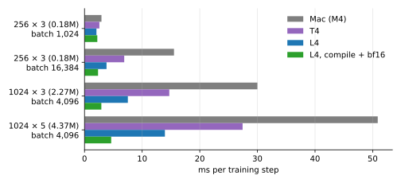

- At batch 1024 every device is bound by kernel launches (about 2 ms); large batches and compilation are where the GPU pays.
- The T4 lacks bf16, which makes it slower; it was dropped from the instance list.
- Evaluation of one set (4,096 windows, 125 frames) takes 0.2 s on the Mac and 0.06 s on the L4.

The batch sweep (`sweeps/batch.txt`) trained the 256 × 3 model on 100M windows each (1 − R² on val_policy_wm3). The differences are small, except that batch 16,384 needs lr 4e-3:

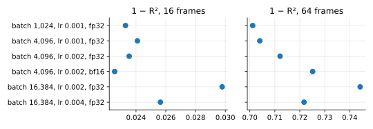

All later runs use batch 4096, lr 2e-3, compile and bf16 on the GPU.

## Phase 1: scaling model size and training length

With one-step training, the best model was 512 × 3 after 246M windows (0.0199 at 16 frames), about 15% better than the original 175k-parameter recipe (0.0233, batch 1024, 100M windows); nothing fixed the long horizon near upright.

Each of 8 sizes (widths 256–2048, depths 3 and 5) trained one 200k-step constant-rate run, with cooldown branches at 12.5k to 200k steps (`cloud/queues/scaling.txt`). A branch at step b cools down over another 0.2 b steps, so it trains on 1.2 b × 4096 windows, 61M to 983M: 40 finished models for about 1.4× the cost of the 200k-step runs.

1 − R² at 16 frames on val_policy_wm3 (lower is better), by training windows:

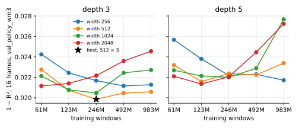

- Small models improve with length to the end; models of 2M parameters and more are best at 61–246M windows, then get worse as they overfit.
- On val_random_walk the same pattern holds: the largest models go from about 0.036 to 0.056 at 16 frames over the longer runs.
- From upright, 0.5 s ahead, every one of the 40 models scores 1 − R² between 1.54 and 1.64: worse than predicting no change. Capacity and length do not fix it.

## Rollout training

Training on K-frame rollouts of the model's own predictions (`rollout_train`), with gradients through the whole rollout, cut the 0.5 s error from upright up to 5×; longer rollouts help the long horizon and cost some short-horizon accuracy.

All runs: 512 × 3, 50k steps (205M windows), batch 4096, lr 2e-3, unless noted. 1 − R² on val_policy_wm3, lower is better; "from upright" is its upright subset. K = 64 is the run with gradient clipping and lr 1e-3.

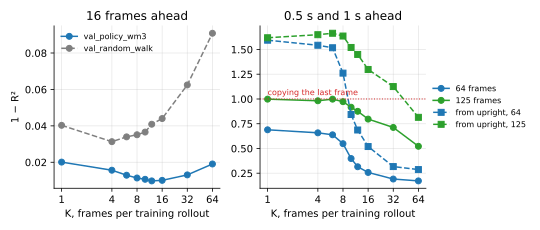

- K = 12–16 give the best short horizon (about 2× better than one-step); K = 64 gives the best long horizon, and is the only model below 1 at 1 s from upright.
- K = 64 diverged at lr 2e-3; gradient clipping at norm 1.0 (`max_grad_norm`) and lr 1e-3 made it train. Clipping changes little at K = 32 (0.351 against 0.317 from upright at 64 frames).
- At K = 16, more steps (100k), width (1024) or history (32 frames) add nothing: all score within 0.06 of the base run from upright at 64 frames. Data and objective, not capacity, limit these models.

## Closed-loop fidelity on four policies

On the first closed-loop test the K = 8 model looked best: +1.19 for the balancing policy ppo-wm3 against +1.22 on the rig, and a mean error of 0.05 over four policies. The policy ranking below overturned this: the test held no policy trained in the model under test.

Predicted sum of cosines per frame for ppo-wm3 (first 10 s from hanging, mean of 32 rollouts), and the mean absolute error over the four policies (ppo-wm3, ppo-persistent, ppo-speed and ppo-wm2, each 10–30 s on the rig), by the rollout length K used in training:

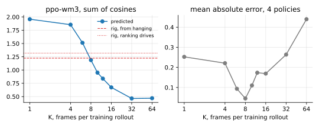

The prediction for ppo-wm3 falls steadily with K: one-step models overrate balancing (the original wm3: +2.14), because they learn a false stable point near upright; long-rollout models underrate it, because averaging the future blurs the small corrections that balancing needs. The three policies that do not balance were predicted within 0.15 by wm3, K = 8 and K = 16.

## A policy trained in the K = 8 model

`ppo-k8` was trained in the K = 8 model (`imagination/configs/wm-k8.toml`) with the recipe that balanced best before (lr 1e-3, 5,000 iterations, speed penalty), on a spot L40S. The K = 8 model scored it +2.30 per frame, a second K = 8 seed +2.15 and wm3 +1.06; I read the second seed's agreement as evidence that it did not exploit its model, and forecast about +2.2 on the rig. On the rig it scores +1.03: wm3, the one model of a different kind, was right. Two seeds of one recipe share its systematic errors, so they do not check each other.

## Policy ranking on the rig

Ranking 20 policies on the rig, after SIMPLER (arXiv:2405.05941), shows which world models can judge policies. Every deterministic model overrates the policies trained in it by 0.4 to 0.8 per frame more than the rest; the sampled stochastic model does not, and ranks and forecasts best.

**Protocol** (`imagination.ranking`, `imagination/ranking/`): each policy runs greedily on the rig for 2 minutes, driving 10 s and resting 5 s, in two passes in shuffled orders. Each drive after the first is an episode: its real score is the sum of the arms' cosines per frame over the drive, and each world model imagines 8 rollouts from the same recorded 16 frames before the drive, with the policy in the loop. There were three sessions, all on 2026-09-27, 14 episodes per policy:

- **Session 1** (13 policies, 52 minutes): `ppo-k8` and four of its checkpoints, six policies trained in wm3, and two older ones.
- **Session 2**: policies trained in K = 1 (two seeds, at 2,000 and 5,000 iterations) and K = 6 (at 1,000 and 5,000), and `ppo-wm3` again. The camera dropped off USB three times; the passes were completed in pieces, which pool as one.
- **Session 3**: `ppo-stoch`, trained in the stochastic world model (next section).

17 of the 20 had never run on the rig, so their data is in no world model's training set. `ppo-wm3` scored +1.33 in session 1 and +1.31 in session 2: the rig held steady.

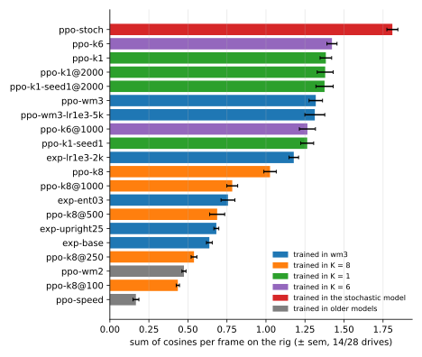

- `ppo-stoch` leads by a wide margin: +1.81 ± 0.04, against +1.42 ± 0.03 for `ppo-k6`, the best from a deterministic model.
- The K = 1 and K = 6 policies improve on `ppo-wm3` (+1.32) by about 0.1. The K = 1 policies gain nothing from 2,000 to 5,000 iterations (seed 0: +1.38 at both; seed 1: +1.38, then +1.26), as the model is exploited further.
- The `ppo-k8` checkpoints improve steadily with training, from +0.44 at iteration 100 to +1.03 at 5,000.

Each world model's prediction against the rig; a perfect model puts every policy on the dotted line. Stars are the policies trained in that model:

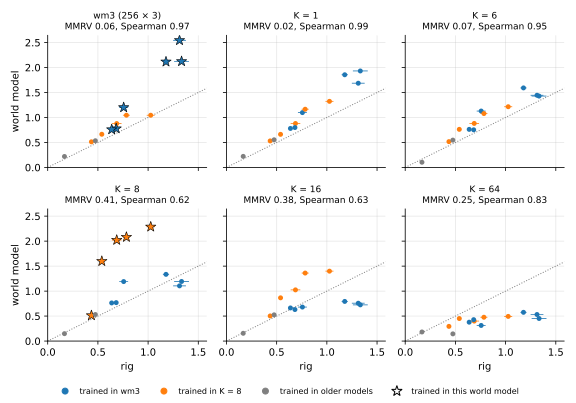

- **Each deterministic model overrates its own policies most.** K = 8 puts its four trained checkpoints at +1.6 to +2.3, against +0.54 to +1.03 real; K = 1 its own at +2.1 to +2.6, against +1.26 to +1.38; wm3 its balancers at +2.1 to +2.5, against +1.2 to +1.3.
- **They misplace `ppo-stoch`.** Every model predicts it at +1.9 to +2.1, below or level with their own policies, so K = 1, K = 6 and wm3 rank it under policies it beats by 0.4 on the rig.
- One-step models overrate balancing across the board; long-rollout models (K = 32, K = 64) underrate every balancer and flatten the order. The stochastic model, sampled, lies along the line.

Each policy's overrating in each world model (predicted − real); stars are the model's own policies:

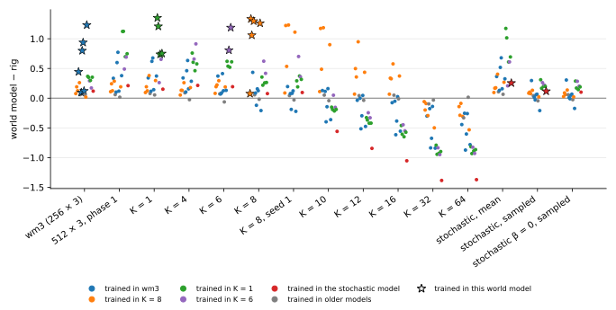

- **The exploitation gap**, how much more a model overrates its own policies than the others, is +0.82 per frame for K = 8, +0.73 for K = 1, +0.74 for K = 6 and +0.41 for wm3; for the stochastic model it is +0.01. The gap grows with training: K = 8 is right about `ppo-k8` at iteration 100 (+0.08) and overrates it by 1.1–1.3 from iteration 250 on.
- **It spreads to the models closest to the one trained in.** K = 8 seed 1, K = 10 and K = 12 overrate the K = 8 policies by up to 1.2 too, though none was trained in them.

Agreement over policies (MMRV, SIMPLER's mean maximum rank violation: 0 is the right order, and a swap costs the real gap between the swapped policies). "Held out" leaves out the policies trained in the model, for the models some were trained in:

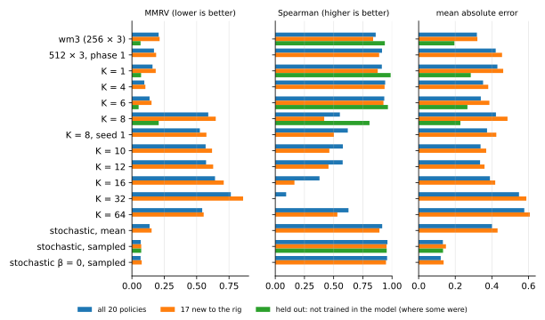

- **The sampled stochastic model is the best judge**: MMRV 0.07, Spearman 0.96, mean error 0.13 and bias +0.10 over all 20. The same network on its mean does as badly as the deterministic one-step models (MMRV 0.14, mean error 0.40).
- Held out, the one-step models rank nearly as well (K = 1: MMRV 0.07, Spearman 0.99; K = 6: MMRV 0.05) but overrate policies by 0.26–0.28 on average; over all policies, own included, their order breaks (MMRV 0.14–0.16).
- K = 8 to K = 64 rank badly (MMRV 0.52–0.76); held out, K = 8 still misorders the best policies (MMRV 0.21).
- Both views matter: held out measures a world model as a judge of other models' policies; all policies, own included, measures it as the forecaster of what is trained in it, which is how `ppo-k8`'s +2.2 was forecast.

## The stochastic world model

A world model that predicts a distribution over the next frame, and is sampled in imagination, trains the best policy yet: `ppo-stoch` scores +1.81 per frame on the rig, 0.4 above any policy from a deterministic model, and the model forecast it at +1.93.

**The model** (`stoch-b05`) is the one-step 512 × 3 recipe of K = 1 with a second output per change: its log-variance, so the change is a normal distribution with a diagonal covariance. It trains on the negative log-likelihood, weighted by the variance to the power β = 0.5 (β-NLL, arXiv:2203.09168), which stops hard transitions from buying a loose fit with a large variance. Imagination draws each frame from it (`tau` 1; `tau` 0 follows its mean). `stoch-b0` is the same with the plain likelihood (β = 0).

**One step ahead**, on val_policy_wm3 (`world_model.compare`, the same 4,096 windows for every model):

- β = 0.5 keeps the mean as accurate as MSE training (one-step MSE 0.0200 against 0.0206 for K = 1); with β = 0 it is a third worse (0.0269), as β-NLL predicts.
- The spread is nearly calibrated: 73% of changes fall within one predicted standard deviation and 94% within two, against 68% and 95% for a normal distribution. The errors are heavier-tailed than the model assumes. The median standard deviation is 8% of a typical frame's change: the noise is small.

**Over many frames**, 8 sampled rollouts per window make an ensemble (`world_model.compare`, `eval_ensemble` in training):

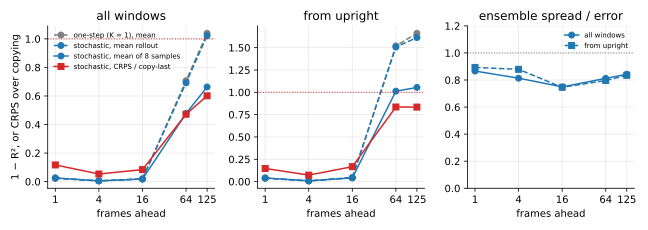

- **The ensemble's mean is far better than the mean rollout** at long horizons: 1 − R² at 64 frames falls from 0.69 to 0.48, and from upright from 1.51 to 1.01, no longer worse than copying the last frame. The mean rollout itself is no better than K = 1's.
- Its CRPS, a proper score of the whole distribution, is 0.47 of copying's at 64 frames (0.84 from upright).
- **The ensemble is somewhat overconfident**: its spread is 0.75–0.85 of its error. A larger `tau` would widen it.

**In closed loop, sampling removes most of the optimism about balancing.** Over the 20 ranked policies, the sampled model overrates by +0.10 on average; the same network on its mean overrates by +0.40, like every deterministic one-step model. For `ppo-wm3` it predicts +1.29 against +1.32 on the rig; on its mean, +1.84. The false equilibrium of one-step models near upright is the mean of futures that fall either way; sampled, the model falls.

Its predictions against the rig, beside the one-step models it compares with: K = 1, the same recipe without the variance, and K = 6, the best of the rollout-trained ones. Stars are the policies trained in each model:

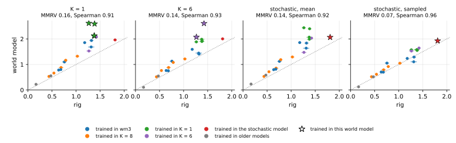

**And it is not exploited.** `ppo-stoch`, trained in it with the recipe of `ppo-k1` (lr 1e-3, 5,000 iterations, speed penalty), scores +1.93 in it and +1.81 on the rig: an exploitation gap of +0.01, against +0.4 to +0.8 for every deterministic model. PPO cannot lean on a fixed point the model does not hold.

Each policy's overrating in the four models (predicted − real), stars marking each model's own policies, and the agreement over all 20:

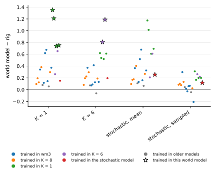

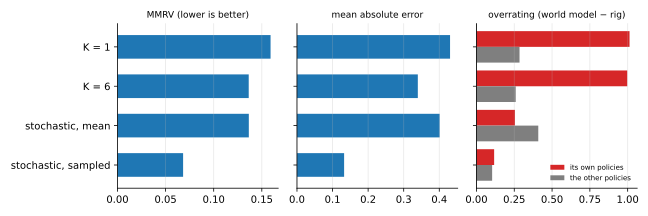

- K = 1 and K = 6 overrate their own policies by about 1.0 per frame and the others by 0.26–0.28; the sampled stochastic model overrates `ppo-stoch` by 0.12 and the others by 0.10.
- Even on its mean, the stochastic model overrates `ppo-stoch` less (+0.26) than the other policies (+0.41): a policy trained against noise does not depend on the mean model's fixed point either. In training, `ppo-stoch` looked weaker than the K = 1 policies (+1.69 in its model from hanging, against about +2.5 in theirs), because its model was honest.

**It balances gently.** On the rig, with all three arms within 30° of upright, 15% of `ppo-stoch`'s actions are at the motor's ±64 limit and 55% within ±16; `ppo-k6`, `ppo-k1` and `ppo-wm3` saturate 48–57% of the time and stay within ±16 only 14–19% of it. It also has all three arms up for 9.5% of its driving, against 3.7% for `ppo-wm3`. A policy trained against noise cannot rely on the hard, exact corrections that a deterministic model rewards.

## Iterating world model, policy and data

Three rounds of collecting with the latest policy, retraining the stochastic world model on everything, and training a policy in it (2026-09-28, unattended) raised the greedy rig score from +1.81 to +2.04–2.08, all in the first round. The policies were given actions to ±96 instead of ±64, and use them: the outer arm is up 25–30% of the time, against 13% for `ppo-stoch`.

**The loop:**
- **Collection 0:** `ppo-stoch`, sampled, with exploration bursts (`collect --perturb-rate 0.02`): on 2% of frames a burst of 3–8 frames starts, adding one offset, uniform in ±48, to every action in it, clipped to ±96 (the motor board's cap, raised from 80). 11% of driving frames are perturbed; the data shows the model what larger and opposing actions do in the states the policy visits. 5 minutes of validation, then 60 of training.
- **World model `stoch-itN`:** `stoch-b05`'s recipe (512 × 3, one-step, β-NLL 0.5, 50k steps) on the original training set, the ranking recordings (about 90 minutes) and collections 0 to N − 1; each collection's 5-minute recording is a validation set.
- **Policy `ppo-stoch-itN`:** `ppo-stoch`'s recipe (lr 1e-3, 5,000 iterations, speed penalty) with 13 actions from −96 to 96, in `stoch-itN` sampled; checked in imagination for arm speeds far above `ppo-stoch`'s before it touches the rig.
- A greedy rig test with the ranking protocol (2 × 2 minutes, 14 drives), then **collection N**: `ppo-stoch-itN`, sampled, without bursts, 5 + 60 minutes.

Each round took about 2½ hours: an hour of collection, 15 minutes of world model and 40 of policy on AWS.

**On the rig**, greedy (black), and each world model's forecast of each policy, sampled, from the same starts:

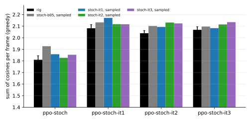

- `ppo-stoch-it1` scores +2.08 ± 0.03 against +1.81 for `ppo-stoch`; `ppo-stoch-it2` and `it3` hold that level (+2.04 and +2.07), no further gain.
- Every world model forecasts every policy within about 0.1 (bias +0.05 over the four), its own included: the loop's exploitation gaps are +0.01 to +0.07.

**What changed on the rig**, over the drives of each greedy test (arms within 30° of upright; actions beyond ±64):

| policy | outer arm up | all three up | actions beyond ±64 | while all three up | at ±96 |
| --- | --- | --- | --- | --- | --- |
| `ppo-stoch` | 13% | 9.5% | — | — | — |
| `ppo-stoch-it1` | 30% | 25% | 23% | 9% | 14% |
| `ppo-stoch-it2` | 25% | 22% | 22% | 13% | 13% |
| `ppo-stoch-it3` | 30% | 27% | 20% | 9% | 13% |

The first two arms were already up most of the time; the gain is the outer arm, and the policies reach past the old ±64 in a fifth of their driving.

**The world models on each collection's validation recording**, filled where the model trained on that collection (`world_model.compare`, the same windows for every model):

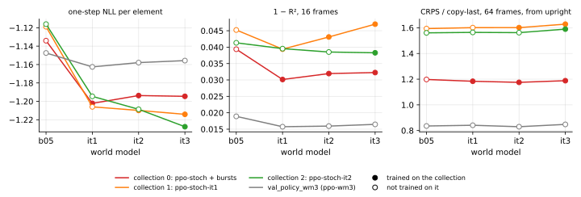

- **The one-step likelihood improves on every new collection, most with the first round.** `stoch-it1`, with the burst collection and the ranking recordings, gains 0.07–0.09 per element on collections 0 to 2, including the two it never trained on; adding a collection then gains a little more on its own recording (collection 2: −1.209 to −1.228).
- **Open loop, the rest barely moves.** 1 − R² at 16 frames improves on the burst collection (0.039 to 0.030) but not on the later ones, where it drifts up (collection 1: 0.039 to 0.047); from upright at 64 frames the CRPS stays above copying's on the new policies' data (1.6), which balance more and so are harder to foresee 0.5 s ahead.
- Every model trains 50k steps whatever the data, so as the data grows from 5 to almost 10 hours each recording is seen less: the models may simply be undertrained for it.

## Scaling the stochastic world model

With twice the data of the first scaling study, the stochastic model's typical prediction keeps improving with size and training length, but its variance overfits, the more so the larger the model, and its long-horizon accuracy does not change. The best all-round choice is the smallest model tried, 256 × 3, trained for 240k steps.

**Setup** (`world_model/configs/stochastic.toml`, 2026-09-28 and 29): the stochastic recipe (`stoch-b05`: a diagonal Gaussian over each change, β-NLL 0.5, batch 4096, lr 2e-3) on all the data so far, about 11 hours: the original recordings, the ranking sessions' greedy runs of 24 policies, and the five loop collections. Each of 8 sizes (widths 256 to 2048, depths 3 and 5) trains one 200k-step run at a constant rate with cooldown branches at 12.5k to 200k steps (`cloud/queues/stochastic-scaling-2.txt`), so each branch trains on 61M to 983M windows. Every model is judged on `val_all`, one pooled set of all nine validation recordings (45 minutes: the random walk, the three original policies and the five loop collections), scored on every 16th window, uniform in time (about 23,000 windows): the NLL per element, its median, the calibration, and the CRPS of 8 sampled rollouts per window.

**The first grid diverged.** At lr 2e-3 the larger models blew up, the larger the sooner, and settled on predicting no change with a huge variance: 2048 × 5 at step 3,850, 2048 × 3 at 6,500, 1024 × 5 at 40,800, 512 × 5 at 115,850, 1024 × 3 at 188,700; 256 × 3 and 512 × 3 never. The NLL's gradient grows as 1/σ², so a rare large step is fatal where MSE would shrug it off. Five 20k-step runs of 2048 × 3 found the cause (`cloud/queues/stochastic-diagnosis.txt`, `val_all` NLL):

| 2048 × 3, 20k steps | NLL | CRPS, 64 frames |
| --- | --- | --- |
| unchanged | +2.92 (diverged) | 0.84 |
| gradient clipping at 1.0 | −1.09 | 0.546 |
| fp32 instead of bf16 | −1.09 | 0.547 |
| lr 5e-4 | −1.11 | 0.544 |
| log-variance floor −7 (from −10) | −0.85 | 0.574 |

Any of clipping, fp32 or a lower rate prevents it; raising the variance floor does not, and costs accuracy. The grid was run again with gradient clipping at 1.0 (`sc-w…`), and every size then trained stably.

**Results**, NLL per element on `val_all` (lower is better; the random walk is part of `val_all`, shown on its own on the right):

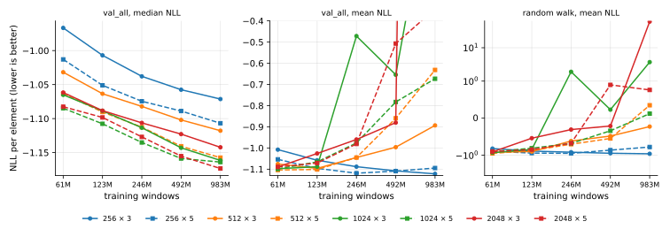

- **The median NLL, the typical window, improves steadily with size and with training**, from −0.97 (256 × 3, 61M windows) to −1.17 (2048 × 5, 983M): every doubling of training helps every size, and size helps up to about 1024 × 3.
- **The mean NLL goes the other way for the larger models**: they do best after the least training and then degrade, 1024 × 3 to +0.36 and 2048 × 3 to +11.75 at 983M windows. Only 256 × 3 and 256 × 5 keep improving; they give the best mean NLL, −1.122 (256 × 3, 983M) and −1.119 (256 × 5, 246M).
- **The random walk carries most of the damage**: it is only 5% of the training data, and there the large models' NLL rises by up to two orders of magnitude.
- **The long horizon does not scale**: the ensemble's CRPS at 64 frames is 0.54–0.56 of copying's in every cell.

**The variance overfits.** The training NLL keeps falling at every size; for large models the validation mean NLL parts from it, while the median follows:

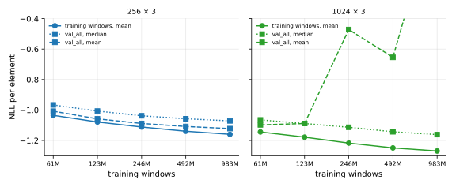

The mean's predictions hardly overfit (validation MSE is flat after 50k steps); it is the variance that learns the training data's errors, which are about half the validation errors, and becomes confidently wrong in a small tail of windows. The NLL charges a confident miss e²/σ², without bound, so a few windows outweigh thousands of small gains, while the median, and the CRPS, which grows only linearly with the error, barely notice. It is the regression version of the overconfidence classifiers show with long training (Guo et al. 2017), and it is epistemic: a single Gaussian cannot say "unfamiliar".

**A two-stage variance does not fix it** at 512 × 3 (`cloud/queues/two-stage-2.txt`). Three mean models trained on MSE, on all the data (`sm-all`) and on each half of it in alternating 60-second blocks (`sm-f0`, `sm-f1`), and a network trained on each window's held-out residual from the fold model that did not see it (`sv-two-stage`), against the joint β-NLL model (`sj-joint`), 50k steps each:

| 512 × 3, 50k steps | val NLL | val median NLL | random walk NLL | ensemble spread / error, 16 frames |
| --- | --- | --- | --- | --- |
| joint (β-NLL) | −1.054 | **−1.080** | −0.68 | 0.70 |
| two-stage | −1.006 | −1.009 | **−0.83** | **0.79** |
| *256 × 3, 60k steps (grid)* | *−1.088* | *−1.038* | *−0.92* | *0.76* |

It helps the tail and the calibration, but loosens the typical window: the half-data models err more than the full one (validation MSE 0.041 and 0.048 against 0.040), so the variance fitted to their residuals is too wide for `sm-all`'s mean.

**The choice: 256 × 3 at 240k steps** (`sc-w256-d3-cd200k`). It has the best mean NLL and gives up little of the median (−1.071, against −1.082 for the 512 × 3 at 50k steps the loop used), 0.18M parameters against 0.6M, so every imagined step is cheaper, and a small model has fewer sharp, confident errors for a policy to find. Ranked against the rig over 24 policies (sampled, 8 rollouts per drive), it judges as well as the 512 × 3 trained on the same data (`stoch-it5`):

| world model | Spearman | MMRV | mean error | bias |
| --- | --- | --- | --- | --- |
| 256 × 3, 240k steps, sampled | 0.97 | 0.06 | 0.10 | +0.08 |
| 512 × 3, 50k steps (`stoch-it5`), sampled | 0.97 | 0.04 | 0.08 | +0.07 |
| 256 × 3, on its mean | 0.95 | 0.11 | 0.33 | +0.33 |

Every result above is one seed per cell; differences under about 0.02 in NLL are within what a second seed might move.

## Annealing the world model's noise

Training a policy in the 256 × 3 stochastic model with its noise rising from none to its own over training gives the best rig score so far, +2.21: better than training with the noise throughout (+2.06) or without it (+1.76). The recipe is `imagination/configs/wm-s256-anneal.toml`.

**Policies** (2026-09-29), all in `sc-w256-d3-cd200k` with the loop's recipe (15 actions to ±126, lr 1e-3, speed penalty, evaluations on 16 sampled rollouts), differing in `tau`, the scale of the sampled noise: 0 is the model's mean, a deterministic model; 1 its own spread.
- `ppo-s256`: τ = 1 throughout, 5,000 iterations.
- `ppo-s256-mean`: τ = 0 throughout, 5,000 iterations.
- `ppo-s256-anneal`: `ppo-s256-mean`'s policy at iteration 3,000 (`imagination.train --init`), then 5,000 iterations with τ rising linearly from 0 to 1 (`tau_start`, `tau_end`), evaluated at the same τ; and its checkpoint at iteration 1,750, τ ≈ 0.35.
- `ppo-s256-anneal0-5k` and `-8k`: the same anneal from scratch, over 5,000 and 8,000 iterations.

Each was tested greedily on the rig with the ranking protocol (14 drives of 10 s after rests) and forecast by the model, sampled and on its mean, from the same starts:

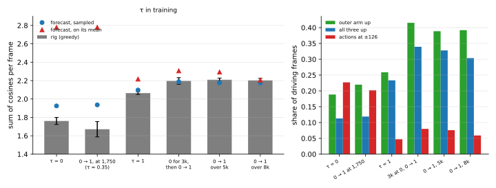

| policy | τ in training | rig | forecast, sampled | forecast, mean | all three up | at ±126 |
| --- | --- | --- | --- | --- | --- | --- |
| `ppo-s256-mean` | 0 | +1.76 ± 0.04 | +1.92 | +2.78 | 11% | 23% |
| `ppo-s256-anneal`, iteration 1,750 | 0 → 0.35 | +1.67 ± 0.08 | +1.94 | +2.78 | 12% | 20% |
| `ppo-s256` | 1 | +2.06 ± 0.01 | +2.10 | +2.22 | 23% | 5% |
| `ppo-s256-anneal` | 0 (3k), then 0 → 1 | +2.20 ± 0.04 | +2.19 | +2.31 | 34% | 8% |
| `ppo-s256-anneal0-5k` | 0 → 1 | **+2.21 ± 0.02** | +2.18 | +2.29 | 33% | 8% |
| `ppo-s256-anneal0-8k` | 0 → 1 | +2.20 ± 0.02 | +2.17 | +2.21 | 30% | 6% |

- **A deterministic model is exploited, even this one.** Trained on the model's mean, the policy is forecast +2.78 there and scores +1.76: it overrates its own policy by 1.0 per frame, against 0.34 for the 24 policies not trained in it, an exploitation gap of about +0.7, as for every deterministic model before. It balances bang-bang, at full torque 23% of the time.
- **Sampled, the same network is honest**: it forecasts that policy at +1.92, and every other within 0.03–0.16; over all 30 rig-tested policies its mean error is 0.10, its MMRV 0.06, its Spearman correlation 0.98. Trained sampled throughout, `ppo-s256` matches the 512 × 3 loop's best (+2.06 against +2.04–2.08), its drives the steadiest of any policy (±0.01).
- **The anneal beats both**, by 0.14 over `ppo-s256`, more than 3 standard errors, in three independent training runs (+2.20, +2.21, +2.20); 8,000 iterations do no better than 5,000, so it is not extra training. The gain is the outer arm: up 39–42% of the time against 26%, all three arms a third of the time.
- **A reading of why**: without noise, the model's signal is clean enough for PPO to find the balancing strategy quickly, but the strategy leans on the mean's false precision, hard exact corrections; raising the noise to the model's own then hardens it, and at the end the policy trains against the same noise as `ppo-s256`. Checkpoint 1,750, still at τ ≈ 0.35, is the mean policy's rig score and saturation; they come right as τ reaches 1.
